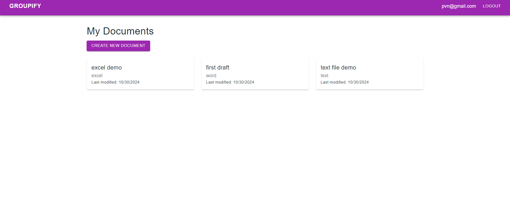

Current Status: 
1. Project Setup and Firebase Integration:
    a. Done
2. Login and Signup Pages:
    a. Done
3. Home Page:
    a. Done

4. Protected Routes: done
5. Header: done
6. Theme: done

Project Look: 
Project Look: 
-------------------
Branch : 2-Home/Dashboard Page
1. Home page structure created
Updated Home:

------------------------------
branch : 3-

4. **Document Creation Form**
   - **Files Needed:**
     - `src/components/DocumentForm.js`
     - Update `src/pages/Home.js` to include form dialog
   - **Steps:**
     1. Create DocumentForm component with fields:
        - Document name (required)
        - Document type (dropdown: Word, Excel, Text)
        - Description (optional)
     2. Add form validation using react-hook-form
     3. Create Firestore document on form submit with:
        - name
        - type 
        - owner (current user ID)
        - createdAt timestamp
        - lastModified timestamp
     4. Add loading state and error handling
     5. Show success message on completion
   - **Libraries:** 
     - `react-hook-form` for form handling
     - `@mui/material` for form components
     - `firebase/firestore` for database operations

**Document Editing Interface**
   - **Files Needed:**
     - `src/components/DocumentEditor.js`
     - Update `src/pages/Home.js` to add editor route
   - **Steps:**
     1. Create DocumentEditor component:
        - Add route in App.js for `/document/:id`
        - Fetch document data from Firestore using document ID
        - Render different editors based on document type:
          - Word/Text: Implement Quill editor
          - Excel: Implement Handsontable
     2. Add save functionality:
        - Auto-save on content changes
        - Update lastModified timestamp
        - Show saving indicator
     3. Add toolbar with formatting options:
        - Text styling for Word/Text
        - Cell formatting for Excel
     4. Handle errors and loading states
     5. Add preview/print options
   - **Libraries:** 
     - `react-quill` for Word/Text editing
     - `handsontable` for Excel editing
     - `@mui/material` for UI components
     - `firebase/firestore` for saving changes

     Current Look: 

Current File Structures:
groupify/
├── public/
├── src/
│   ├── components/  
|         |__ DocumentEditor.js  
|         |__ DocumentForm.js  
|         |__ Header.js  
|         |__ ProtectedRoute.js  
│   ├── firebase/               # Firebase configuration and utility functions
│   │   └── config.js
│   ├── pages/                  # Different page components (e.g., Home, Login, Document)
│       |__ Login.js
│       |__ Signup.js   
│       |__ Home.js
│   ├── context/                # Context for global states (e.g., AuthContext)
│       |__ AuthContext.js
│   ├── hooks/                  # Custom hooks for Firebase interactions
│   ├── styles/                 # Stylesheets (e.g., theme.css, global.css)
|         |_ theme.js
│   ├── App.js                  # Main app component with routing
│   └── index.js                # Entry point
├── .gitignore
├── package.json
└── README.md

<!-- Currnt File structure -->

branch :chat feature within document done

current Look: 

